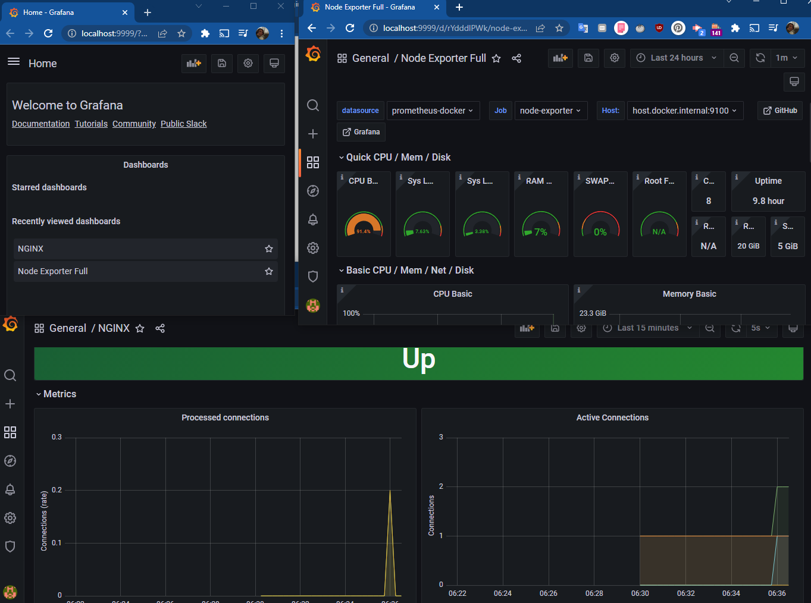
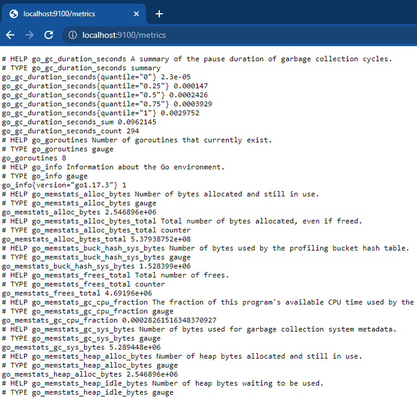
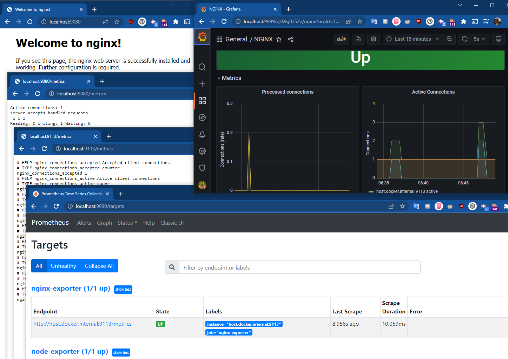
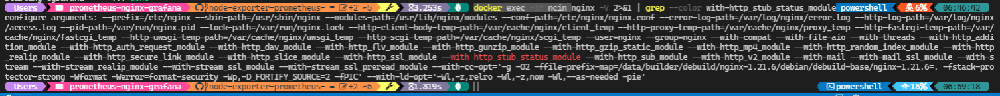
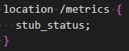
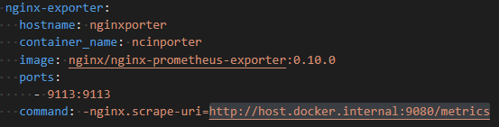

# Ne var burada?
Grafana üstünde sistem ve uygulama metriklerinin gösterimini sağlayan bir konteyner yığını var.
- Grafana
- Prometheus
- Node-exporter
- Nginx-eporter

Bunu sağlamak için aşağıdaki uygulamaları ve aralarındaki ilişkileri tanımlayan `docker-compose.yml` dosyasını ayaklandırmak için `docker-compose up` komutunu çalıştırmak yeterli.

```shell
$ docker-compose up 
```



### node-exporter
Konteynerlerin çalıştığı Linux makinasının sistem metriklerini toplar.


### nginx-exporter
Nginx sunucusunun metriklerini prometheus metrikleri halinde sunar.

### nginx
En meşhur web sunucularındandır (IIS, Apache, Tomcat gibi). Bir web uygulaması yayımlasaydık, uygulama metriklerini (sisteme giriş yapmış anlık ziyaretçi sayısı, yorum yapılan makale sayısı, beğenilerin puanlarına göre bir metrik vs.) yayımlardık. Ancak nginx de bir uygulama olduğu için onun metriklerini nginx-exporter ile sunup, prometheus ile çekip, grafana ile görüntüleyeceğiz. 




## Hangi uygulama hangi adreste?
Kimler hangi portlarda çalışıyor:
- Grafana : http://localhost:9999/ (Kullanıcı Adı: admin, Şifre: admin)
- Prometheus : http://localhost:9090/
- Node-exporter : http://localhost:9100/
- Nginx-eporter : http://localhost:9113/

## Hangi dosya ne ile ilgili?
- `grafana/datasources.yml` : Grafana içinde Prometheus sunucusunu bulması için.
- `grafana/dashboards/dashboard.yml` : Grafana'ya dashboard'ların dizinini içerir.
- `grafana/dashboards/node-exporter-full_rev26-1860.json` : `dashboards` Dizini içindeki göstergelerin (json dosyalarının) Grafana içinde görünmesi için [1860](https://grafana.com/grafana/dashboards/1860) ID'li **Node Exporter Full** isimli göstergenin [json](https://grafana.com/api/dashboards/1860/revisions/26/download) dosyasıdır.
- `grafana/dashboards/nginx-dashboar.json` : nginx Metriklerini görüntülemek için hazırlanmış dashboard. Varsayılan olarak metrikleri görüntüleyecektir. 

## Nginx'in metrikleri nasıl çekilir? ([kaynak](https://www.tecmint.com/enable-nginx-status-page/))
Nginx, metrikleri dışarıya sunmak için   modülünü kullanır. Nginx çalıştığında ayarlar dosyasındaki varsayılan duruma göre bu modülü aktif veya pasif eder. 
Eğer modül faal ise komutun çıktısında modüllerin satırında kırmızı renkle işaretlenmiş olarak `--with-http_stub_status_module` metni gelecektir:
```shell
$ nginx -V 2>&1 | grep --color with-http_stub_status_module
```

nginx Konteynerinin adı ncin olduğu için:
```shell
docker exec -it ncin nginx -V 2>&1 | grep --color with-http_stub_status_module
```


Bu modül aktif edilmişse `nginx/nginx.conf` dosyasında `localhost:9080/metrics` adresine gelindiğinde metrikleri sunan `stub_status` fonksiyonu çalıştırılması için ayar yapılmalı: 



nginx-exporter çalışırken ona hangi nginx sunucusuna gideceği bilgisini konteyner başlatma komutlarında veriyoruz:

